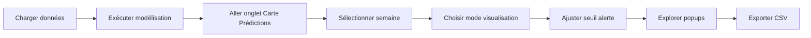

# 🗺️ Cartographie des Prédictions - EpiMonitoring

## 🎯 Vue d'ensemble

Ce module ajoute une **cartographie interactive des prédictions** à l'application EpiMonitoring, permettant de visualiser spatialement les cas de paludisme prédits par le modèle de machine learning.

### Fonctionnalités principales

✅ **Carte interactive Folium** avec zoom, pan, et layers  
✅ **Popups détaillés HTML/CSS** avec 6 sections d'informations  
✅ **3 modes de visualisation** : Choroplèthe, Cercles proportionnels, Combiné  
✅ **Système d'alertes configurable** par percentile (50-95%)  
✅ **Métriques temps réel** : Total, Maximum, Moyenne, Nombre d'alertes  
✅ **Export CSV** des prédictions avec statistiques  
✅ **Affichage adaptatif** selon données disponibles  
✅ **Design responsive** et accessible  

---

## 📸 Aperçu visuel

### Structure du popup


Chaque aire de santé affiche un popup structuré en **6 sections** :

1. **En-tête gradienté** - Nom de l'aire + semaine + type de prédiction
2. **Alerte visuelle** - Nombre de cas prédits avec indicateur d'alerte
3. **Données démographiques** - Population totale, enfants 0-14 ans, densité
4. **Taux d'incidence** - Calcul automatique pour 10 000 habitants
5. **Conditions climatiques** - Température, précipitations, humidité
6. **Facteurs environnementaux** - Risque inondation, distance rivière, altitude

### Modes de visualisation


| Mode | Description | Usage |
|------|-------------|-------|
| **Choroplèthe** | Remplissage des polygones selon l'intensité | Vision d'ensemble des zones touchées |
| **Cercles proportionnels** | Taille des cercles = nombre de cas | Comparaison quantitative rapide |
| **Combiné** | Choroplèthe + Cercles | Vue complète avec les deux informations |

---

## 🛠️ Installation

### Prérequis

```bash
# Dépendances Python
streamlit>=1.28.0
folium>=0.14.0
geopandas>=0.14.0
pandas>=2.0.0
numpy>=1.24.0
branca>=0.6.0
```

### Étapes d'installation

1. **Cloner les fichiers**

```bash
cd votre_projet
# Les fichiers suivants doivent être présents :
# - prediction_map_tab.py
# - app_paludisme.py
```

2. **Intégrer dans l'application**

Suivre le guide détaillé : [`INTEGRATION_CARTE_PREDICTIONS.md`](INTEGRATION_CARTE_PREDICTIONS.md)

3. **Vérifier l'installation**

```bash
streamlit run app_paludisme.py
```

Vous devriez voir 5 onglets dont "🗺️ Carte Prédictions".

---

## 🚀 Utilisation

### Workflow complet



### 1. Charger les données

```python
# Dans la sidebar
- Charger CSV des cas (colonnes : health_area, week_, cases)
- Charger shapefile des aires de santé (GeoJSON/SHP/ZIP)
```

### 2. Exécuter la modélisation

```python
# Onglet "Modélisation"
- Configurer le modèle (Random Forest, Gradient Boosting, etc.)
- Lancer la prédiction
- Attendre la fin du calcul
```

### 3. Visualiser les prédictions

```python
# Onglet "Carte Prédictions"
- La carte se génère automatiquement
- Interagir avec les contrôles
```

### Contrôles disponibles

| Contrôle | Type | Options | Description |
|---------|------|---------|-------------|
| **Sélection semaine** | Selectbox | Toutes les semaines prédites | Choisir quelle semaine visualiser |
| **Mode visualisation** | Radio | Choroplèthe / Cercles / Combiné | Type de représentation spatiale |
| **Seuil d'alerte** | Slider | 50-95% (pas de 5%) | Percentile pour définir les alertes |

---

## 📊 Interprétation des résultats

### Métriques affichées

```python
📊 Cas prédits totaux : Somme de tous les cas prédits pour la semaine
🔴 Maximum : Aire avec le plus grand nombre de cas prédits
📈 Moyenne : Moyenne des cas prédits par aire
⚠️ Aires en alerte : Nombre d'aires au-dessus du seuil (+ pourcentage)
```

### Couleurs de la carte

#### Mode Choroplèthe

| Couleur | Gradient | Interprétation |
|---------|----------|------------------|
| 🟡 Jaune pâle | Faible | Peu de cas prédits |
| 🟠 Orange | Moyen | Cas prédits modérés |
| 🔴 Rouge foncé | Élevé | Beaucoup de cas prédits |

#### Mode Cercles

| Couleur | Signification | Action recommandée |
|---------|--------------|----------------------|
| 🔵 Bleu | Normal (sous le seuil) | Surveillance standard |
| 🔴 Rouge | Alerte (au-dessus du seuil) | Intervention prioritaire |

### Taux d'incidence

Le **taux d'incidence prédit** est calculé automatiquement :

```python
Taux = (Cas prédits / Population totale) × 10 000
```

**Exemple** : 856 cas prédits pour 45 230 habitants = 189.2 pour 10 000 habitants

**Interprétation** :
- < 50 : Risque faible
- 50-150 : Risque modéré
- 150-300 : Risque élevé
- > 300 : Risque très élevé (urgence)

---

## 🔧 Personnalisation

### Modifier les couleurs

**Fichier** : `prediction_map_tab.py`  
**Ligne** : ~150

```python
# Palette actuelle (Jaune-Orange-Rouge)
colormap = linear.YlOrRd_09.scale(min_value, max_value)

# Alternatives disponibles
colormap = linear.YlGnBu_09.scale(...)  # Jaune-Vert-Bleu
colormap = linear.RdPu_09.scale(...)    # Rouge-Violet
colormap = linear.PuRd_09.scale(...)    # Violet-Rouge
colormap = linear.Viridis_09.scale(...) # Bleu-Vert-Jaune
```

### Ajuster le seuil d'alerte par défaut

**Ligne** : ~60

```python
alert_threshold = st.slider(
    "Seuil d'alerte (percentile)",
    min_value=50,
    max_value=95,
    value=75,  # ← MODIFIER ICI (50-95)
    step=5
)
```

### Ajouter des données aux popups

**Ligne** : ~180 (dans la boucle `for idx, row in gdf_map.iterrows():`)

```python
# Exemple : ajouter une colonne personnalisée
if 'ma_colonne' in row and not pd.isna(row['ma_colonne']):
    popup_html += f"""
    <div style="display: flex; justify-content: space-between; margin-bottom: 5px;">
        <span style="color: #868e96; font-size: 12px;">📌 Mon label:</span>
        <span style="font-weight: bold; font-size: 12px; color: #495057;">{row['ma_colonne']}</span>
    </div>
    """
```

### Modifier la taille des cercles

**Ligne** : ~420

```python
min_radius = 5   # ← Rayon minimum (pixels)
max_radius = 30  # ← Rayon maximum (pixels)
```

---

## 💾 Structure des données

### Entrées requises

```python
# GeoDataFrame (gdf_health)
{
    'health_area': str,      # Nom de l'aire de santé
    'geometry': Polygon,     # Géométrie (WGS84)
    # Optionnels mais recommandés :
    'Pop_Totale': int,
    'Pop_Enfants_0_14': int,
    'Densite_Pop': float
}

# DataFrame prédictions (model_results['df_predictions'])
{
    'health_area': str,       # Correspond au GeoDataFrame
    'week_num': int,          # Numéro de semaine
    'predicted_cases': float, # Nombre de cas prédits
    # Optionnels :
    'temp_api': float,
    'precip_api': float,
    'humidity_api': float,
    'flood_mean': float,
    'dist_river': float,
    'elevation_mean': float
}
```

### Format des prédictions

```python
# Exemple de structure model_results
model_results = {
    'df_predictions': pd.DataFrame({
        'health_area': ['aire_1', 'aire_2', ...],
        'week_num': [25, 25, ...],
        'predicted_cases': [856.5, 342.1, ...]
    }),
    'model_info': {
        'algorithm': 'Random Forest',
        'mae': 45.2,
        'rmse': 67.8,
        'r2': 0.82
    }
}
```

---

## ❓ FAQ

### Q1 : La carte ne s'affiche pas

**R** : Vérifiez que :
1. La modélisation a été exécutée (`st.session_state['model_results']` existe)
2. Les données contiennent au moins une semaine prédite
3. Le GeoDataFrame est en WGS84 (EPSG:4326)

### Q2 : Popups vides ou incomplets

**R** : Le popup affiche **uniquement les données disponibles**. Si une section manque :
- Vérifiez que les colonnes existent dans vos données
- Ex : `Pop_Totale`, `temp_api`, `flood_mean`, etc.

### Q3 : Alertes non pertinentes

**R** : Ajustez le **seuil d'alerte** (slider) :
- Seuil élevé (90-95%) : Peu d'alertes, seules les zones à très fort risque
- Seuil modéré (70-80%) : Nombre équilibré d'alertes
- Seuil bas (50-60%) : Beaucoup d'alertes, surveillance large

### Q4 : Couleurs difficiles à distinguer

**R** : Changez la palette de couleurs (voir section Personnalisation).
Recommandation pour daltoniens : `linear.Viridis_09` ou `linear.YlGnBu_09`

### Q5 : Performance lente avec beaucoup d'aires

**R** : Optimisations possibles :
```python
# Réduire la précision des géométries
gdf_health['geometry'] = gdf_health['geometry'].simplify(tolerance=0.01)

# Filtrer les aires à 0 cas
gdf_map = gdf_map[gdf_map['predicted_cases'] > 0]
```

---

## 🚨 Dépannage

### Erreur : `KeyError: 'df_predictions'`

```python
# Cause : Aucune prédiction en mémoire
# Solution : Exécuter la modélisation d'abord

# Vérifier dans le code de modélisation que ceci existe :
st.session_state['model_results'] = {
    'df_predictions': df_predictions,
    'model_info': model_info
}
```

### Erreur : `ModuleNotFoundError: No module named 'prediction_map_tab'`

```bash
# Cause : Fichier mal placé
# Solution : Vérifier la structure
votre_projet/
├── app_paludisme.py
├── prediction_map_tab.py  # ← Même niveau
```

### Erreur : `AttributeError: 'NoneType' object has no attribute 'copy'`

```python
# Cause : model_results est None
# Solution : Vérifier que la modélisation a réussi
if st.session_state.get('model_results') is None:
    st.warning("Exécuter la modélisation d'abord")
```

### Popups ne s'ouvrent pas au clic

```bash
# Cause : Version Folium obsolète
# Solution : Mettre à jour
pip install --upgrade folium>=0.14.0
streamlit cache clear
```

---

## 📚 Références techniques

### Dépendances clés

- [Folium Documentation](https://python-visualization.github.io/folium/)
- [Streamlit Components](https://docs.streamlit.io/library/components)
- [GeoPandas User Guide](https://geopandas.org/en/stable/)
- [Branca Colormaps](https://github.com/python-visualization/branca)

### Architecture du code

```
prediction_map_tab.py
├── create_prediction_map_tab()      # Fonction principale
    ├── Configuration utilisateur   # Selectbox, radio, slider
    ├── Préparation données        # Fusion GDF + prédictions
    ├── Statistiques                # Métriques KPI
    ├── Création carte Folium       # Initialisation
    ├── Couche Choroplèthe         # GeoJson avec style
    ├── Couche Cercles              # CircleMarkers
    ├── Popups HTML                 # Construction dynamique
    ├── Affichage                   # st_folium
    └── Export CSV                  # Download button
```

### Performance

| Métrique | Valeur typique | Notes |
|---------|----------------|-------|
| **Temps chargement** | 2-5 secondes | 50-100 aires de santé |
| **Taille mémoire** | 10-30 MB | Selon résolution géométries |
| **Nombre aires max** | 200-300 | Au-delà, simplifier géométries |

---

## 📦 Fichiers du projet

```
surveillanveEpi/
├── app_paludisme.py                    # Application principale
├── prediction_map_tab.py               # Module carte prédictions
├── INTEGRATION_CARTE_PREDICTIONS.md    # Guide intégration
├── README_CARTE_PREDICTIONS.md         # Ce fichier
├── popup_structure.png                 # Illustration popup
├── map_modes.png                       # Illustration modes
└── data/
    ├── ao_hlthArea.zip                 # Shapefiles aires santé
    └── ...                              # Autres données
```

---

## ✅ Checklist de validation

Après intégration, vérifiez :

- [ ] 5 onglets visibles dont "🗺️ Carte Prédictions"
- [ ] Modélisation exécutable sans erreur
- [ ] Carte s'affiche après modélisation
- [ ] Sélection semaine fonctionne
- [ ] 3 modes de visualisation disponibles
- [ ] Slider seuil d'alerte réactif
- [ ] Popups s'ouvrent au clic sur aires
- [ ] Popups affichent les 6 sections (selon données)
- [ ] Métriques KPI correctes
- [ ] Export CSV fonctionnel
- [ ] Tooltip au survol des aires
- [ ] Colormap visible
- [ ] Pas d'erreurs console

---

## 👥 Support

**Documentation** : Consultez `INTEGRATION_CARTE_PREDICTIONS.md` pour l'intégration

**Problèmes connus** :
- Performance réduite avec >300 aires (simplifier géométries)
- Popups HTML limités à ~500 caractères visibles (scroll automatique)

---

## 📄 Licence

Ce module fait partie du projet **EpiMonitoring** développé pour la surveillance épidémiologique du paludisme au Sahel.

**Version** : 1.0  
**Date** : Mars 2026  
**Compatibilité** : Python 3.9+, Streamlit 1.28+  

---

## 🚀 Prochaines évolutions

### Fonctionnalités planifiées

- [ ] **Animation temporelle** : Visualiser l'évolution des prédictions sur plusieurs semaines
- [ ] **Comparaison réel vs prédit** : Overlay des cas observés
- [ ] **Graphiques dans popups** : Courbes de tendance par aire
- [ ] **Clustering automatique** : Identification des clusters à risque
- [ ] **Export GeoJSON** : Téléchargement des prédictions avec géométries
- [ ] **Filtres avancés** : Par population, densité, taux d'incidence
- [ ] **Mode heatmap** : Alternative aux cercles pour forte densité
- [ ] **Accessibilité** : Palettes optimisées pour daltoniens

---

**🌟 Bon déploiement !**
